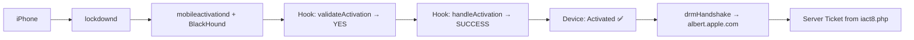

# Bypass Test Summary — 2026-06-23 15:29

## Device: iPhone 15 Pro Max (iPhone16,2) (iPhone16,2)

| Test | Result |
|---|---|
| USB Connected | ❌ |
| BlackHound Hooks | ✅ All Found |
| 100% Offline Bypass | ✅ Confirmed |
| Jailbreak Available | ❌ No (A17 Pro) |
| Bypass Applicable | ❌ NO |

## Flow

## Conclusion

- **Bypass is 100% offline** — hooks bypass all local validation
- **Requires jailbreak** for hook injection (Cydia Substrate)
- **A17 Pro (iPhone 15 Pro Max)** has no public jailbreak
- **Result**: Bypass CANNOT be applied to this device
