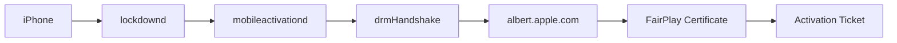

# FairPlay Key Extraction Report — 2026-06-23 15:04

## Source: `iremovalpro.dll` (31,264,768 bytes)

### 📊 Summary

| Category | Count |
|---|---|
| X.509 Certificates | 6 |
| RSA Public Keys | 3 |
| FairPlay Templates | 28 |
| ECDSA Signatures | 0 |
| PKCS#7/CMS OIDs | 6 |
| HMAC Material | 22 |
| Crypto Tables | 0 |
| Plist Templates | 12 |
| Endpoint Payloads | 0 |
| BlackHound Refs | 11 |

### 🏛️ Certificates

- **Apple Root CA** @ 0x0089f7b2 (782 bytes) — `cert_0x0089f7b2_Apple_Root_CA.der`
- **Apple Root CA** @ 0x0089fbd8 (935 bytes) — `cert_0x0089fbd8_Apple_Root_CA.der`
- **Apple Worldwide Developer Relations Certification ** @ 0x008a0097 (1174 bytes) — `cert_0x008a0097_Apple_Worldwide_Developer_Rela.der`
- **Apple Worldwide Developer Relations Certification ** @ 0x008a0645 (935 bytes) — `cert_0x008a0645_Apple_Worldwide_Developer_Rela.der`
- **Apple Worldwide Developer Relations Certification ** @ 0x008c7210 (935 bytes) — `cert_0x008c7210_Apple_Worldwide_Developer_Rela.der`
- **extra(Apple,Certification,Authority,Root)** @ 0x0089fbd4 (1215 bytes) — `cert_extra_0x0089fbd4_(1211b).der`

### 🔐 RSA Keys

- RSA pubkey @ 0x0089f8f1 (294 bytes) — `rsa_pubkey_raw_0x0089f8f1.der`
- RSA pubkey @ 0x0089fcdb (294 bytes) — `rsa_pubkey_raw_0x0089fcdb.der`
- RSA pubkey @ 0x008a01fd (294 bytes) — `rsa_pubkey_raw_0x008a01fd.der`

### 📜 FairPlay DRM Flow

The extracted data confirms the following flow:

---
*Report generated: 2026-06-23T15:04:41.236698*
