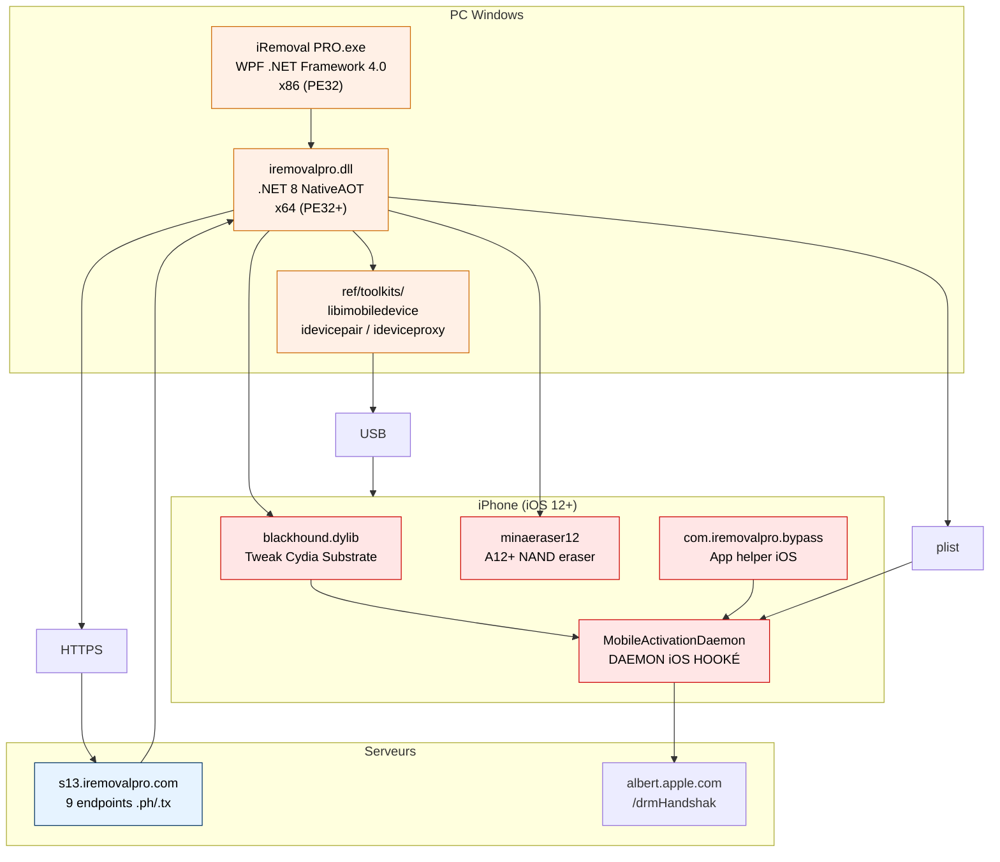
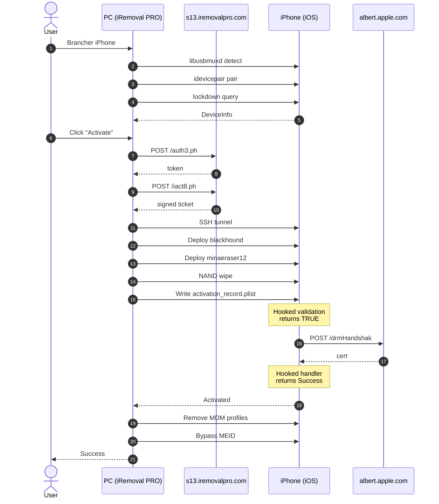
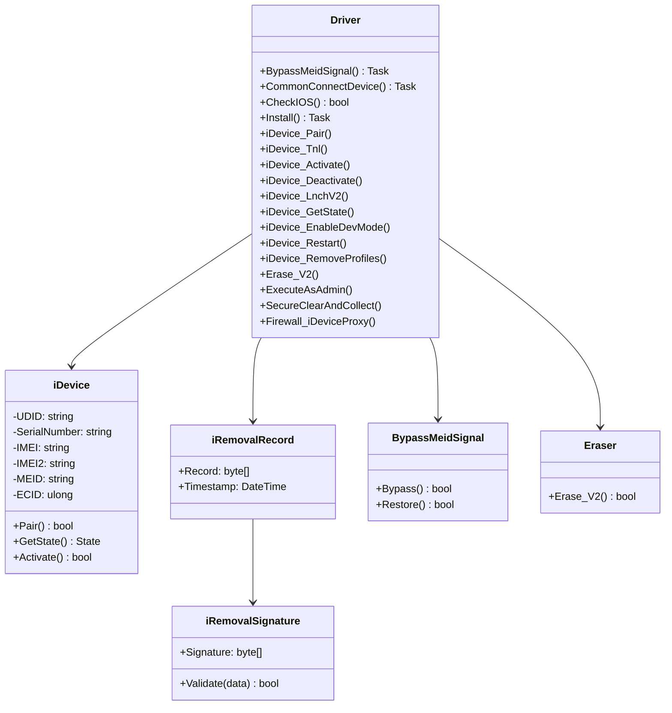
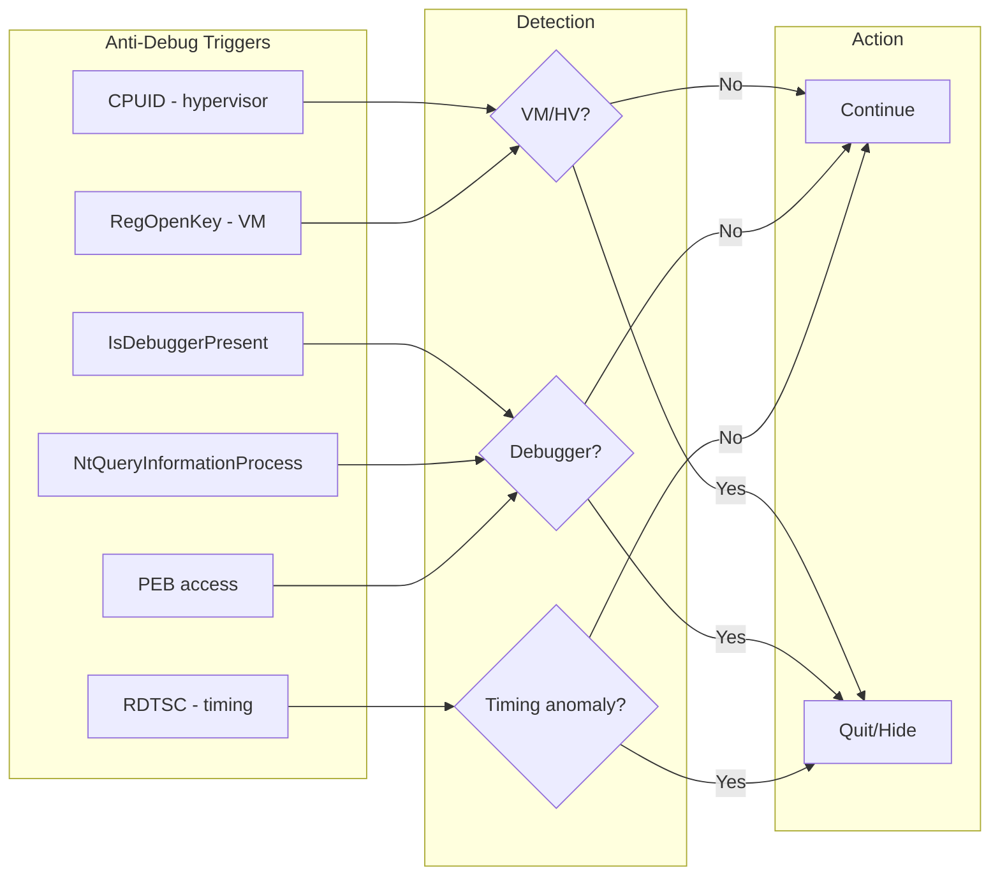
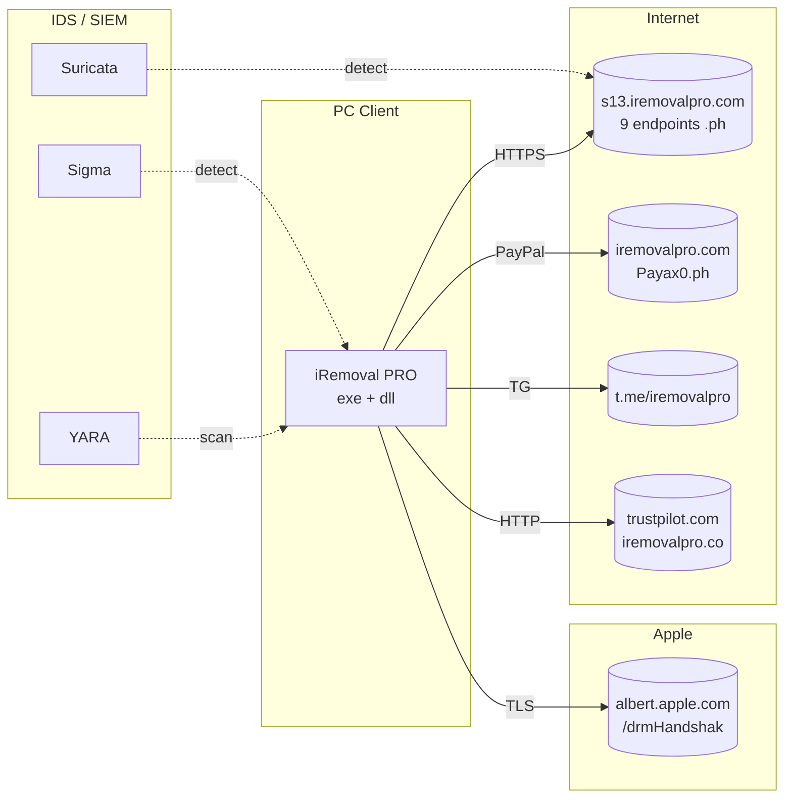

# Mermaid Diagrams — iRemoval PRO Premium Edition v5.2

> Visualisations de l'architecture, du flux d'activation, et de la topologie réseau.
>
> **Source** : [`ARCHITECTURE.mmd`](../ARCHITECTURE.mmd)
> **Visualiseur recommandé** : https://mermaid.live/ ou tout IDE avec extension Mermaid

---

## 1. Architecture des composants

**Légende** :
- 🔴 Rouge = Composants iOS malveillants (tweak, daemon hooké)
- 🔵 Bleu = Serveur C2
- 🟠 Orange = Binaire de l'outil (PC)

---

## 2. Flux d'activation bypass (séquence)

---

## 3. Diagramme de classes

---

## 4. Techniques anti-debug

---

## 5. Topologie réseau C2

---

## 🔧 Utilisation

### Visualisation en ligne
1. Ouvrir https://mermaid.live/
2. Copier le contenu de `ARCHITECTURE.mmd`
3. Visualiser en temps réel

### Visualisation IDE (VS Code)
- Installer l'extension "Markdown Preview Mermaid Support"
- Ouvrir ce fichier `.md` en preview

### Export PNG/SVG
- Via Mermaid CLI : `mmdc -i ARCHITECTURE.mmd -o diagram.png`
- Via https://mermaid.live/ (bouton export)

---

**Mis à jour** : 2026-06-22

